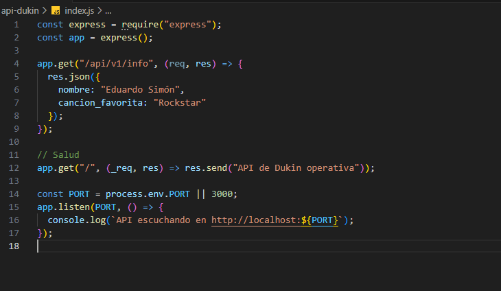
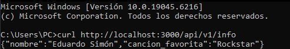
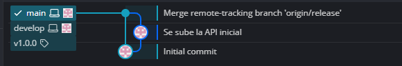

# AyDS1_202200309_2S2025

## API con nombre y canción favorita: 

## Respuesta de la API inicial 

## Tag de la primera version 

## Creamos y trabajamos en rama Hotfix:

## API con nombre y album favorito:

## Respuesta API final: 

# Se fusiona la rama hotfix con la rama main y develop

## Tag para la segunda version

## Se elimina la rama hotfix
