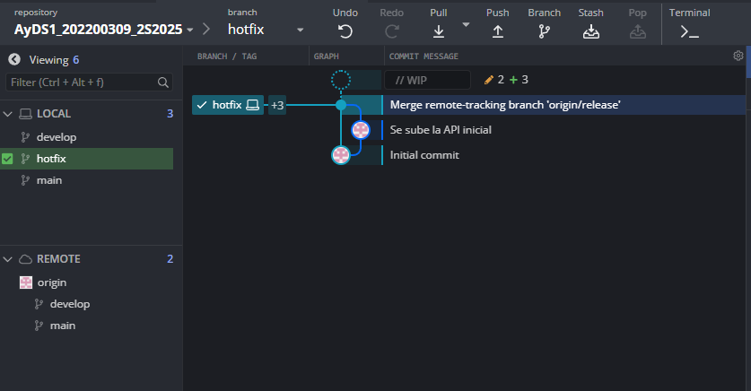
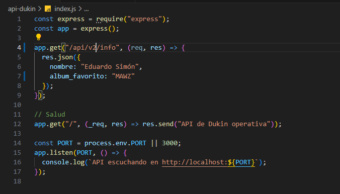
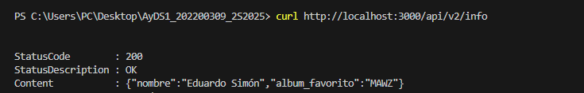
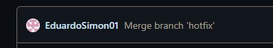
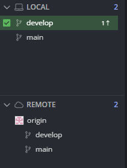

# Identificar requerimientos
### Angel Eduardo Tubac Simón
### 20220009
### Laboratorio análisis y diseño de sistemas

Para la identificación de requerimientos primeramente se deben identificar los actores, luego identificar los requerimientos de cada actor en la aplicación (requerimientos funcionales), identificar lso requerimientos que tiene que tener la aplicación como tal (requerimientos no funcionales) y por ultimo haremos un diagrama UML en draw.io para representar los requerimientos funcionales.

## Actores

* Cliente: quien comprará dentro de la aplicación
* Administrador: quien tendrá el manejo administratiuvo de la aplicación
* Proveedor: quien reabastecerá la aplicación de productos
* Empresa de envíos: quien gationará los envíos que se programen en la aplicación
* Empresa de pagos: quien administrará el sistema de pago dentro de la aplicación

<<<<<<< HEAD
## Creamos y trabajamos en rama Hotfix:

## API con nombre y album favorito:

## Respuesta API final: 

# Se fusiona la rama hotfix con la rama main y develop

## Tag para la segunda version

## Se elimina la rama hotfix

=======
## Requerimientos funcionales

* Requerimientos para usuarios:
    * Creación de usuarios dentro de la aplicación
    * Inicio de sesión para comprar
    * Carrito de compras (agregar productos y quitarlos)
    * Busqueda de productos
    * Filtros para busqueda de productos
    * Solicitud de reembolsos
* Requerimientos para administrador:
    * Gestion de productos (agregar y quitar del stock)
    * Gestión de usuarios (modificarlos y eliminarlos)
    * Consulta de ventas (diarias, semanales, mensuales y anuales)
    * Opciones para añadir nuevos productos
    * Gestión de devoluciones (aceptar y rechazar)
* Requerimientos de proveedor: 
    * Aumento de stock de productos
    * Pedido de stock de ciertos artículos en especial
* Requerimientos de empresa de envíos: 
    * Pesaje de los productos
    * Consultas de direcciones
    * Envío de notificaciones
* Requerimientos de la empresa de pagos: 
    * Posibilidad de introducir tarjetas
    * Envío de notificaciones

## Requerimientos no funcionales

1. Buen rendimiento para mantener el interés del cliente
2. Seguridad para los datos de los usuarios y sus tarjetas
3. Disponibilidad para que los usuarios puedan comprar siempre
4. Compatibilidad para diferentes dispositivos
5. Escalabilidad para mas productos y mas clientes
6. Mantenimiento con código documentado

## Diagrama UML 

>>>>>>> Feat/Tarea2
